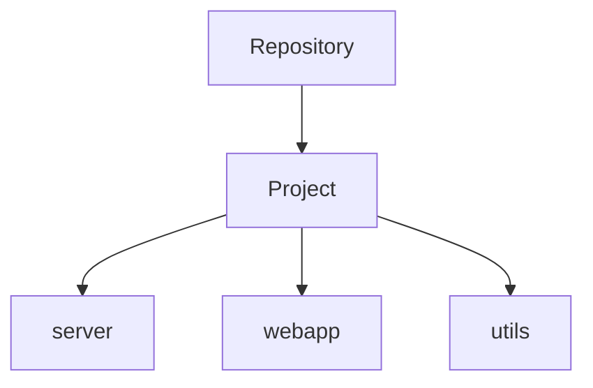
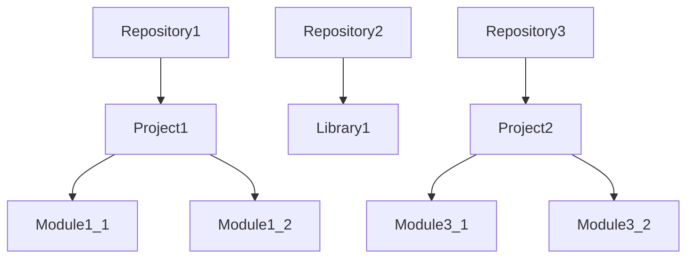
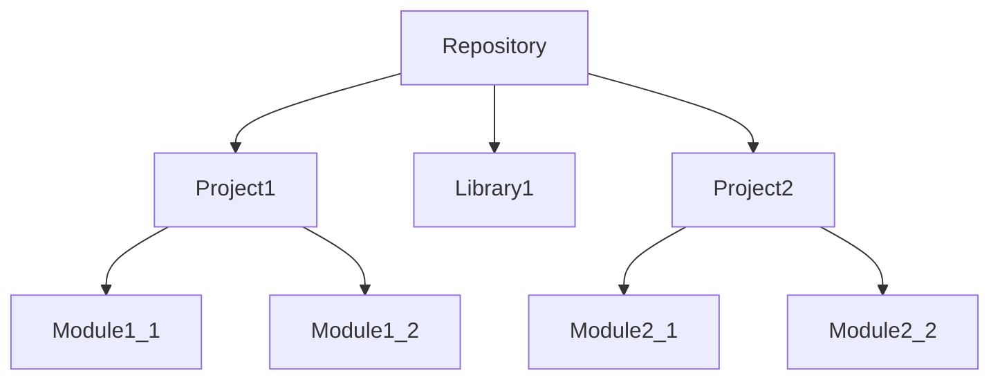

+++
title = 'Abstracting Complexity - Organization'
date = 2024-01-21T09:12:07-05:00
tags = ["Architecture"]
draft = true
+++

Another major factor in mantaining a project is organization. More specifically we will be leavaring two tools: git and versioning.

How do we choose to organize our code within a git repository? How do we 

Space: Git and types of repositories.
Time: Versioning

our code. We will briefly visit three of the most common ways projects are organized in the context of repositories.

## Monolithic
A monorepo houses everything within out repository. This is the simplest approach.

But happens if our project grows, we no longer have a single application to maintain but multiple? We could still house everything within a single repository but things become harder to maintain, build times become longer, and so do tests. 

## Multirepo 
A multirepo approach can aliviate some of these issues, we would simply house each code base within their own repository.

This is a fine approach, specially for projects that are decoupled. We start instroducing complexity into our project when we have dependencies between one another. Changes to one repository 

## Monorepo
A monorepo provides a middle ground 

For my 