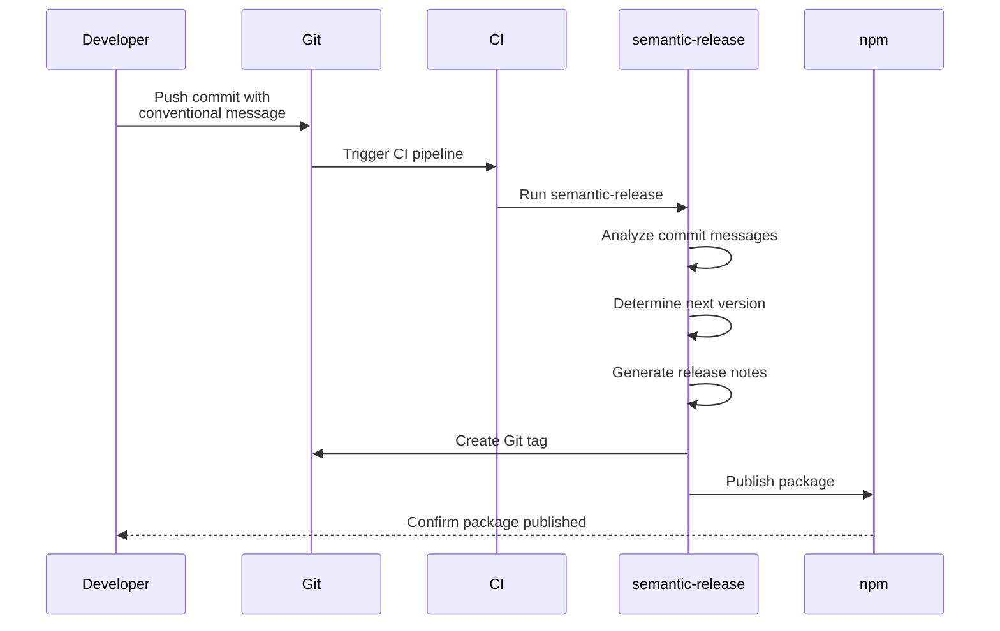

+++
title = 'Abstracting Complexity - Packages'
date = 2024-01-25T06:54:42-05:00
draft = true
+++

In order to find the optimal way to handle package building and deployment let's establish our goals!

We are going to (in isolation for a single package) try to automate building, deploying, versioning and generating a change log.

## Instroducing: semantic-release.

"semantic-release automates the whole package release workflow including: determining the next version number, generating the release notes, and publishing the package." 

This effectively solves deployment 3 out of 4 of our goals.

We can handle the building step by leveraging a github workflow. 

As always, nothing is every truly free. And in our case we must adopt a new convention into our development workflow (do note that I consider this an absolute benefit as it drives consistancy and maintaining a relevant commit history).

The convetion is as follows: When commiting we must use the following syntax `type(scope):subject` or a more *semantic* example `git commit -m 'bug(auth): Fixed session timeout issue causing premature logouts'` we can provide additional information through the body and references in the footer but we will skip those, but for brevity I have included those examples [here](https://gist.github.com/onajourney/f875edb9e88840787303dbbe6fe3be14).

A quick reference of types: 

- **feat✨:** A new feature
- **fix🐛:** A bug fix
- **docs📚:** Documentation changes
- **style🖊️:** Fixing whitespace, improving readability, or complying with coding style guidelines (Not design or CSS changes)
- **refactor🔨:** Code changes that neither fixes a bug or adds a feature
- **perf📈:** change that improves performance
- **test🧪:** Test related (adding missing tests, refactoring tests)
- **chore🧹:** Changes to the build process

As long as we follow these conventions and through some CI magic our push requests should start the following process:



## Setting up - Code

We must first install sementic-release into our project. 

`npm install --save-dev semantic-release`

Will keep things simple by operating without plugins and using defaults for options and modes. 

We will also pass any options we need via the CLI to avoid polluting our project directory until it makes sense to have a configuration file (either due to complexity or the need to in the case of using and configuring a plugin).

Since sementic release defaults to the primary branch, a simple command in our `package.json` file should suffice! 

```
"scripts": {
  "release": "semantic-release"
}
```

We have two choices for package publishing - we could incorporate it into our github workflow or let semantic release handle it. 

Lastly we will create our workflow file `.github/workflows/build-and-publish.yml`:
```yml
name: Build and Publish

on:
  push:
    branches: [ main ]
  pull_request:
    branches: [ main ]

jobs:
  build:
    runs-on: ubuntu-latest
    strategy:
      matrix:
        node-version: [18.x, 20.x, 'node'] # 'node' is the latest

    steps:
    - uses: actions/checkout@v3
    - name: Use Node.js ${{ matrix.node-version }}
      uses: actions/setup-node@v3
      with:
        node-version: ${{ matrix.node-version }}
    - run: npm ci

  publish:
    needs: build-and-test
    runs-on: ubuntu-latest
    if: github.ref == 'refs/heads/main' # Run only on push to main
    steps:
    - uses: actions/checkout@v3
    - name: Setup Node.js
      uses: actions/setup-node@v3
      with:
        node-version: 'node'
    - run: npm ci
    - name: Semantic Release
      run: npx semantic-release
      env:
        GITHUB_TOKEN: ${{ secrets.GITHUB_TOKEN }} # semantic-release uses this to create releases on GitHub
        NPM_TOKEN: ${{ secrets.NPM_TOKEN }} # semantic-release uses this to publish your package to npm 
```
Set the node-version matrix to the versions you want your package to support, or set it to the version your application uses to ensure compatibility.

I will skip testing as in the context of our fictional package we don't have any - BUT DO TEST. Testing is at the heart of automation and CI/CD.

Update your test script to run your tests, and add a testing step or job to your workflow. 

## Setting up - Secrets

If we want to automate pushing to NPM we must setup a token for semantic-release to use (which the workflow is expecting in `NPM_TOKEN: ${{ secrets.NPM_TOKEN }}`).

Generate a secret in your NPM account (A granular token with write access), set expiry to taste.

Add said token to you repository under `Settings->Secrets and variables->Actions` as a secret repository secret `NPM_TOKEN`.

