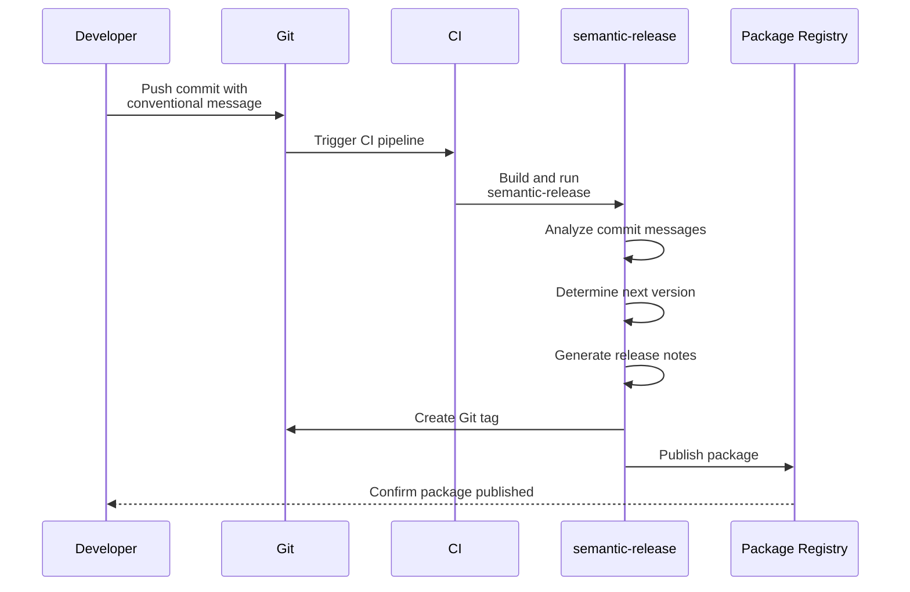

+++
title = 'Abstracting Complexity - Packages'
date = 2024-01-25T06:54:42-05:00
draft = false
+++

In order to find the optimal way to handle package building and deployment let's establish our goals!

We are going to (in isolation for a single package) try to automate building, deploying, versioning and generating a change log. So that every push to our main branch triggers the following process::



## Introducing: semantic-release.

"semantic-release automates the whole package release workflow including: determining the next version number, generating the release notes, and publishing the package." 

This effectively addresses three out of four of our goals.

We can handle the building step by leveraging a github workflow. 

As always, nothing is ever truly free. And in our case we must adopt a new convention into our development workflow (do note that I consider this an absolute benefit as it drives consistancy and maintaining a relevant commit history).

The convention is as follows: When commiting we must use the following syntax `type(scope):subject` or a more *semantic* example `git commit -m 'bug(auth): Fixed session timeout issue causing premature logouts'`. Do note that scope is optional and we can provide additional information through the body and references in the footer but we will skip those, but for brevity I have included those examples [here](https://gist.github.com/onajourney/f875edb9e88840787303dbbe6fe3be14).

A quick reference of types: 

- **feat✨:** A new feature
- **fix🐛:** A bug fix
- **docs📚:** Documentation changes
- **style🖊️:** Fixing whitespace, improving readability, or complying with coding style guidelines (Not design or CSS changes)
- **refactor🔨:** Code changes that neither fixes a bug or adds a feature
- **perf📈:** change that improves performance
- **test🧪:** Test related (adding missing tests, refactoring tests)
- **chore🧹:** Changes to the build process

Only fix and feat will trigger new releases. Since it uses semantic versioning (MAJOR.MINOR.PATCH), this means a 'fix' will bump up the patch version, and a 'feat' will bump up the minor version. To increase the major version, you must include 'BREAKING CHANGE' in the body of the commit message.

## Setting up - Code

Rather than installing `npm install --save-dev semantic-release` locally and setting up a script command in our package.json file

```
"scripts": {
  "release": "semantic-release --branches main"
}
```
we will let our work flow handle it without touching our codebase. We will do the same for our build process.

Let's create our workflow file `.github/workflows/build-and-publish.yml`:

```yml
name: Build and Publish

on:
  push:
    branches: [ main ]
  pull_request:
    branches: [ main ]

jobs:
  build:
    runs-on: ubuntu-latest

    steps:
    - uses: actions/checkout@v4
    - name: Use Node.js 20
      uses: actions/setup-node@v4
      with:
        node-version: 20.x
    - name: Bundle and Minimize with esbuild
      run: npx esbuild src/index.js --bundle --minify --outfile=dist/index.js
    - name: Copy package.json to dist (for publishing)
      run: cp package.json dist/
    - name: Archive production artifacts
      uses: actions/upload-artifact@v4
      with:
        name: publishing-artifacts
        path: dist

  publish-to-github:
    needs: build
    permissions:
      contents: write
      packages: write
    runs-on: ubuntu-latest
    if: github.ref == 'refs/heads/main'
    steps:
    - uses: actions/checkout@v4
    - name: Setup Node.js
      uses: actions/setup-node@v4
      with:
        node-version: 20.x
        registry-url: 'https://npm.pkg.github.com/'
    - name: Download built artifacts
      uses: actions/download-artifact@v4
      with:
        name: publishing-artifacts
        path: dist
    - name: Update Package Name To Follow Scope Naming
      run: cd dist && npm pkg set name="@$(echo ${{ github.repository_owner }} | tr '[:upper:]' '[:lower:]')/$(npm pkg get name | jq -r .)"
    - name: Semantic Release
      run: cd dist && npx semantic-release --branches main
      env:
        GITHUB_TOKEN: ${{ secrets.GITHUB_TOKEN }}
        NODE_AUTH_TOKEN: ${{ secrets.GITHUB_TOKEN }}
        NPM_TOKEN: ${{ secrets.NPM_TOKEN }}
```

I will skip testing within our workflow as in the context of our fictional package we don't have any tests - BUT DO TEST. Testing is at the heart of automation and CI/CD.

Since in my example I am publishing to the gihub package registry I have a step to rename my package to follow githubs scoped naming convention - this is not necessary, you could of course just name the package following this convention. I have also provided an example for publishing to NPM [here](https://gist.github.com/onajourney/d8f3aa09deb4f9950c660a4ab8bbf9d3). And an attempt at publishing to both GitHub packages and npm [here](https://gist.github.com/onajourney/e5a0b372be30e19220db818ba190b31d) (this one is a WIP as there is a race condition between the publishing jobs- only ones wins the race, the other one sees the tags in the repository and assumes it has already published).


## Conclusion

Overall, I am happy with this process for publishing a package. I no longer need to worry about minimizing/building my JS code as the workflow handles it for me. I no longer have to worry about publishing as the workflow handles it for me. Same for release notes and versioning.

